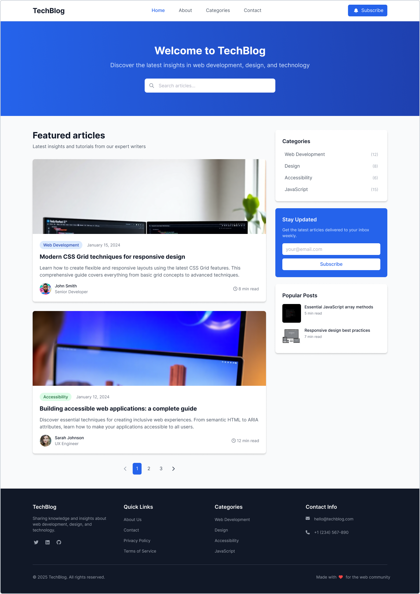
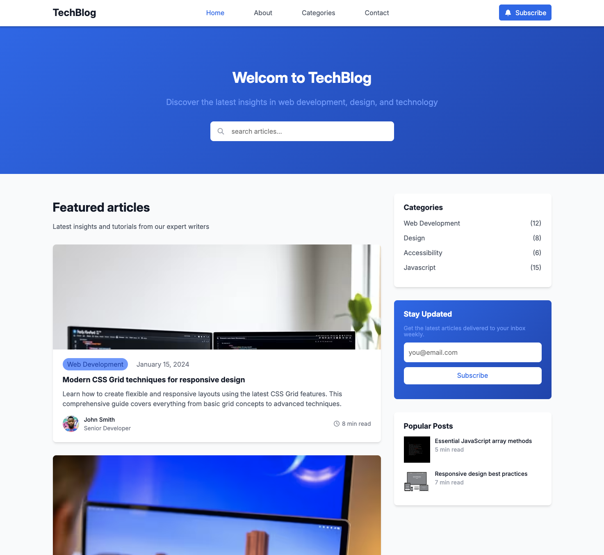

<!-- @format -->

# Lexicon IT Proffs - Tech Blog Solution

This is a solution to the Tech Blog challenge by [Lexicon IT Proffs](https://lexicon.se) for the front-end developer bootcamp.

## Table of contents

- [Lexicon IT Proffs - Tech Blog Solution](#lexicon-it-proffs---tech-blog-solution)
  - [Table of contents](#table-of-contents)
  - [Overview](#overview)
    - [Screenshot](#screenshot)
    - [Links](#links)
  - [My process](#my-process)
    - [Built with](#built-with)
    - [What I learned](#what-i-learned)
    - [Useful resources](#useful-resources)
  - [Author](#author)

## Overview

### Screenshot

Desktop

Mobile

### Links

- Solution URL: [Coming Soon]()
- Live Site URL: [Girhub repo](https://github.com/serfoll/lexicon-tech-blog)

## My process

### Built with

- Semantic HTML5 markup
- CSS custom properties
- Flexbox
- CSS Grid
- Mobile-first workflow
- BEM naming convention

### What I learned

- Coming soon

### Useful resources

- Coming Soon

## Author

- Twitter - [@sergio_fol](https://www.twitter.com/sergio_fol)
